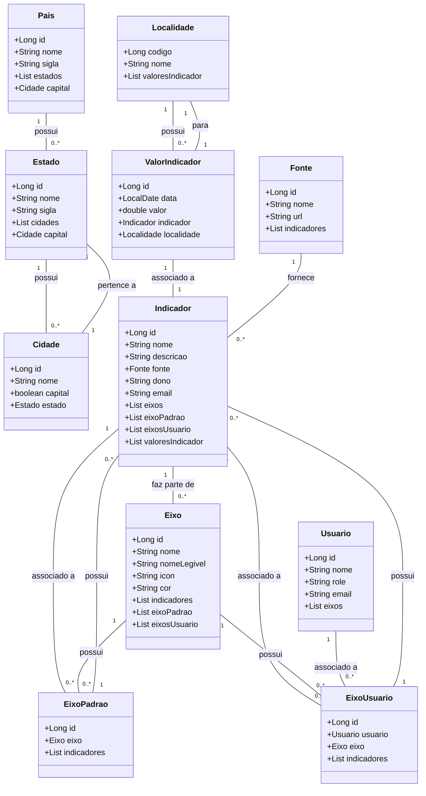

## SonarQube

[](https://sonarcloud.io/summary/new_code?id=JJDSNT_java_backend)
&nbsp;
[](https://sonarcloud.io/summary/new_code?id=JJDSNT_java_backend)
&nbsp;
[](https://sonarcloud.io/summary/new_code?id=JJDSNT_java_backend)
&nbsp;
[](https://sonarcloud.io/summary/new_code?id=JJDSNT_java_backend)
&nbsp;
[](https://sonarcloud.io/summary/new_code?id=JJDSNT_java_backend)
&nbsp;
[](https://sonarcloud.io/summary/new_code?id=JJDSNT_java_backend)
&nbsp;
[](https://sonarcloud.io/summary/new_code?id=JJDSNT_java_backend)
&nbsp;
[](https://sonarcloud.io/summary/new_code?id=JJDSNT_java_backend)
&nbsp;
[](https://sonarcloud.io/summary/new_code?id=JJDSNT_java_backend)
&nbsp;
[](https://sonarcloud.io/summary/new_code?id=JJDSNT_java_backend)
&nbsp;
[](https://sonarcloud.io/summary/new_code?id=JJDSNT_java_backend)


Esse é o backend para um dashboard de indicadores civicos inspirado nos códigos:

https://github.com/digitalinnovationone/santander-dev-week-2023-api

e

https://github.com/falvojr/santander-dev-week-2023


# Sistema de Gestão de Indicadores

Este sistema é uma aplicação para gerenciamento de indicadores relacionados a diferentes localidades, como países, estados e cidades. Utiliza Java com Spring Boot e JPA para persistência de dados e o banco de dados relacional para armazenar informações sobre indicadores e suas respectivas localidades.

## Estrutura do Sistema

### Entidades

- **Pais**: Representa um país e contém informações como nome e sigla. Relaciona-se com estados e define a capital do país.
- **Estado**: Representa um estado dentro de um país. Contém informações sobre o nome, sigla e uma lista de cidades. Define uma capital.
- **Cidade**: Representa uma cidade dentro de um estado. Inclui informações sobre o nome e se é uma capital.
- **Localidade**: Entidade base que representa uma localidade geral com um código IBGE e nome. Relaciona-se com valores de indicadores.
- **ValorIndicador**: Armazena o valor de um indicador para uma determinada localidade em uma data específica.
- **Indicador**: Define um indicador com nome, descrição, fonte e outras informações. Relaciona-se com eixos, eixos padrão e eixos de usuários.
- **Eixo**: Representa um eixo de categorização de indicadores com informações sobre nome e cor. Relaciona-se com indicadores, eixos padrão e eixos de usuários.
- **EixoPadrao**: Representa um eixo padrão que agrupa indicadores. Relaciona-se com eixos e indicadores.
- **EixoUsuario**: Relaciona usuários com eixos e indicadores específicos. Inclui a configuração personalizada de indicadores por usuários.
- **Fonte**: Representa a origem dos indicadores, com nome e URL.
- **Usuario**: Representa um usuário do sistema, com nome, email e papel. Relaciona-se com eixos de usuários.

### Funcionalidades

- **Gerenciamento de Localidades**: Cadastro e edição de países, estados e cidades.
- **Gestão de Indicadores**: Cadastro e associação de indicadores com fontes e categorias.
- **Visualização de Dados**: Acesso a valores de indicadores por data e localidade.
- **Personalização por Usuário**: Configuração de indicadores e eixos específicos para cada usuário.

## Tecnologias Utilizadas

- **Java**: Linguagem de programação.
- **Spring Boot**: Framework para construção de aplicações Java.
- **JPA/Hibernate**: Mapeamento objeto-relacional para persistência de dados.
- **Banco de Dados Relacional**: Armazenamento das entidades e relacionamentos.

## Como Executar

1. **Clone o Repositório**:
   ```bash
   git clone https://github.com/JJDSNT/java_backend.git
   ```
2. **Navegue para o Diretório do Projeto:**:
   ```bash
   cd java_backend
   ```
3. **Configure o banco de dados** Ajuste as configurações de conexão no arquivo application.properties ou application.yml.

4. **Execute o projeto**:  
   ```bash
   ./mvnw spring-boot:run
   ```
4. **Acesse os endpoints**:  
   ```bash
   http://localhost:8080/swagger-ui.html
   ```


## Diagrama de Classes (Domínio da API)

