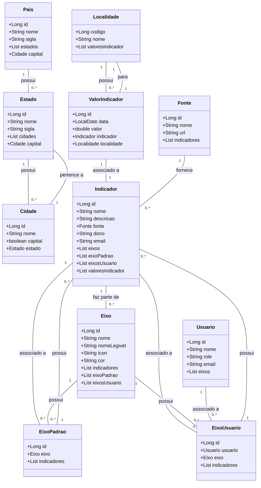

Esse é o backend para um dashboard de indicadores civicos inspirado nos códigos:

https://github.com/digitalinnovationone/santander-dev-week-2023-api

e

https://github.com/falvojr/santander-dev-week-2023

